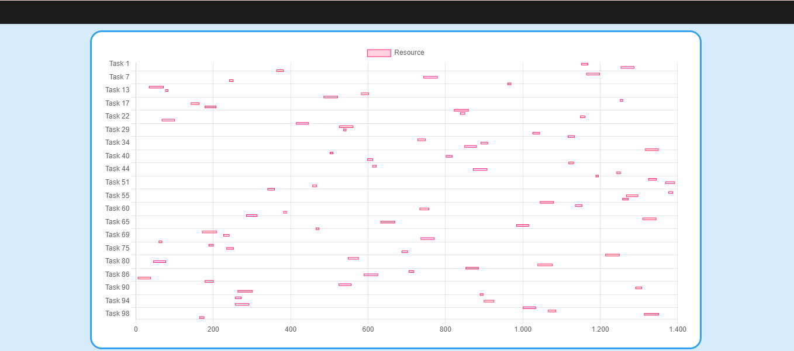
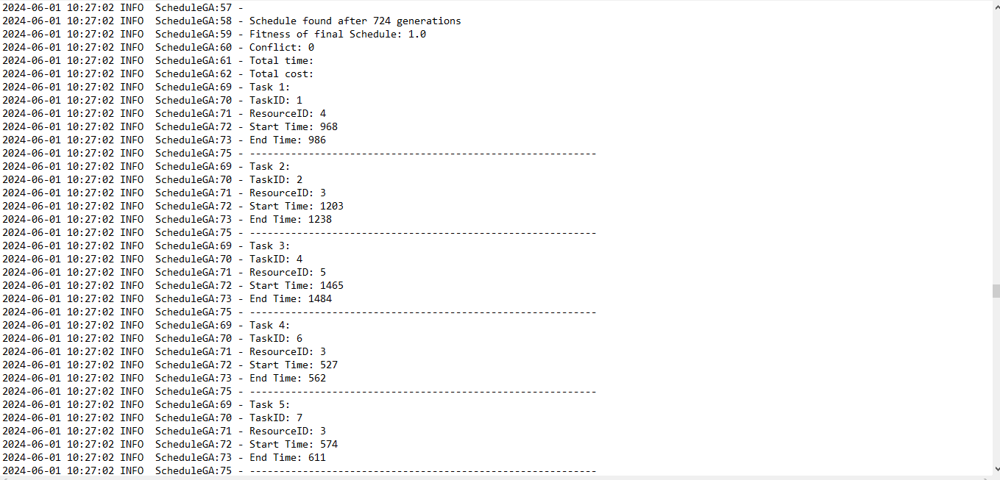

# 13Scheduler
Project: Optimal Job Scheduling with Constraints

Problem Introduction
The RCPSP (Resource-Constrained Project Scheduling Problem) addresses project scheduling under limited resource constraints. MS-RCPSP (Multi-Skill RCPSP) extends the original RCPSP by incorporating multi-skill constraints for resources. In the MS-RCPSP problem, each resource can possess multiple skills, each with different proficiency levels. Tasks require specific skills at a certain level, and only resources meeting these requirements can execute them.

Input:
A set of resources, where each resource has an associated cost and a set of skills, each skill carrying a specific weight.
A set of tasks, where each task has a duration and a list of prerequisite tasks that must be completed first.
Output:
A scheduled list of tasks that satisfy all constraints while optimizing time and cost.

# Sample Data File
backend/src/main/java/Schedule/ScheduleApp/data.txt

# Demo
1. Select input file

2. Out put result

3. Out put log
Satisfy the constraints:

